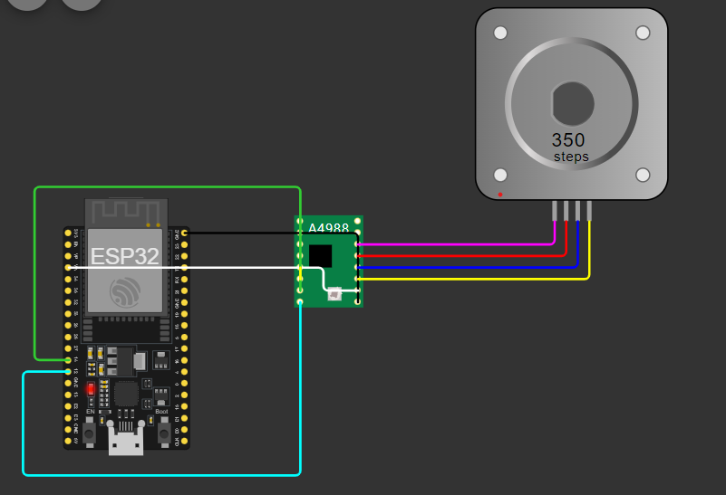

## **Controlling Stepper Motor Speed and Direction using A4988 motor driver and ESP32**

## Basic imports
* **machine library:** Provides access to hardware specific functions such as controlling GPIO pins
* **time module:** Provides functions for time

## **Connection as per code**
* DIR_PIN: Controls the direction of the motor. It's connected to GPIO 12 of the ESP32.
* STEP_PIN: Controls the step pulses to move the motor. It's connected to GPIO 14 of the ESP32.
* GND of ESP32 is connected to GND of A4988
* VIN of ESP32 is connected to VDD of A4988
* A1, A2, B1, B2 -> A-, A+, B-, B+

